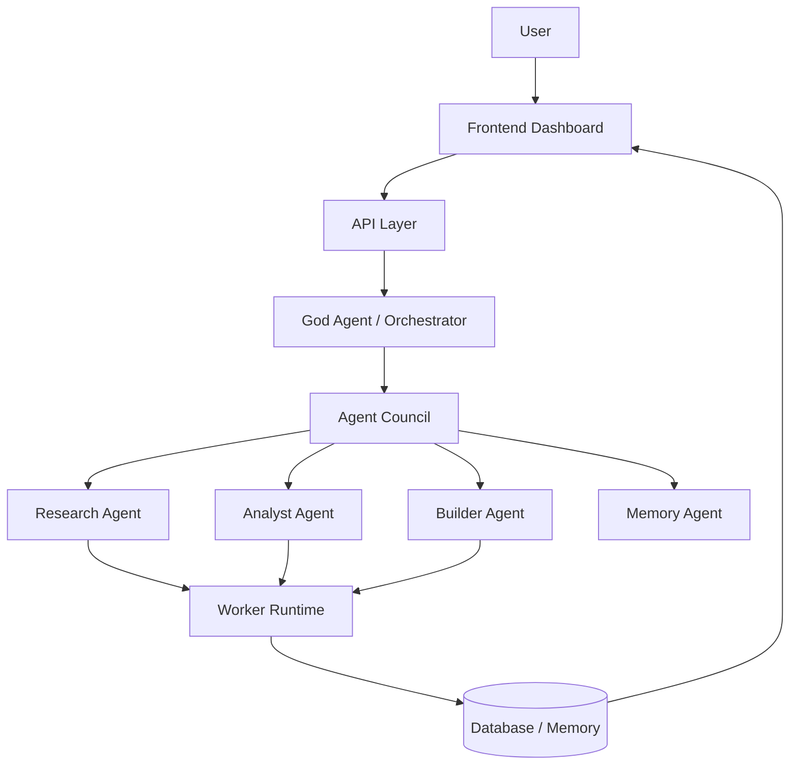

# MurMur
Main MurMur repo
# MURMUR : A Learning Constellation

MurMur is a multi-agent AI system where specialized agents collaborate,
debate and evolve ideas together.

Instead of one AI answering questions,
MurMur creates an ecosystem of agents.

Teacher Agent
Experimental Agent
Think Tank
Reflection Agent
Council Agents
God Agent Orchestrator

Together they form a learning constellation.

---

## Vision

AI should not just answer questions.

It should think together.

MurMur is an experiment in collective intelligence.

---

## Core Systems

MurMur Core Engine  
MurMur Agent Council  
MurMur Narrative Intelligence Engine  
MurMur Creator Studio  
MurMur Cloud Terminal  

---

## Architecture

## Goal

Build the first open ecosystem of collaborative AI agents.
